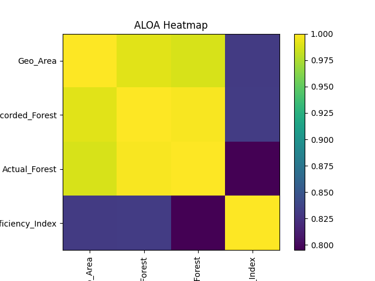

🌲 Forest Intelligence System using ALOA
Optimizing Forest Cover Prediction with Bio-Inspired Algorithms
👤 Author

Sagnik Patra

📌 Project Overview

This project builds an end-to-end Machine Learning pipeline to analyze and predict forest cover across Indian states using:

🌿 Forest Deficiency Index
📊 Data visualization (heatmaps, prediction graphs)
🤖 ML models (Random Forest)
🧠 Bio-inspired optimization (Ant Lion Optimization Algorithm - ALOA)

The system generates production-ready outputs including models, metrics, visualizations, and prediction files.

🎯 Objectives
Analyze Recorded vs Actual Forest Cover
Create a Forest Deficiency Index
Optimize model performance using ALOA
Generate visual insights & predictions
Export results in multiple formats
📂 Project Structure
Forest-Intelligence-System/
│
├── data/
│   └── Rajya_Sabha_Session_237_AU2437_1.1.csv
│
├── outputs/
│   ├── aloa_heatmap.png
│   ├── aloa_results.csv
│   ├── aloa_predictions.csv
│   ├── aloa_results_graph.png
│   ├── aloa_prediction_graph.png
│   ├── aloa_optimization_graph.png
│   ├── aloa_model.pkl
│   ├── aloa_metrics.json
│   └── aloa_config.yaml
│
├── src/
│   └── aloa_pipeline.py
│
└── README.md
📊 Visual Insights
🔥 Correlation Heatmap

👉 This heatmap shows relationships between:

Geographical Area
Recorded Forest
Actual Forest
Forest Deficiency Index
🧠 Algorithm Used
🐜 Ant Lion Optimization Algorithm (ALOA)
Simulates hunting mechanism of antlions
Uses random walk + elitism strategy
Balances:
Exploration (searching new solutions)
Exploitation (refining best solutions)
⚙️ Features
✅ Data Cleaning & Preprocessing
✅ Feature Engineering
✅ Correlation Heatmap
✅ ALOA-based Hyperparameter Optimization
✅ Model Training (Random Forest)
✅ Predictions & Evaluation
✅ CSV + JSON + YAML Export
✅ Visualization Graphs
📈 Outputs Generated
📊 Data Files
aloa_results.csv → Model predictions (test set)
aloa_predictions.csv → Full dataset predictions
📈 Graphs
aloa_heatmap.png
aloa_results_graph.png
aloa_prediction_graph.png
aloa_optimization_graph.png
🤖 Models
aloa_model.pkl
⚙️ Config
aloa_metrics.json
aloa_config.yaml
🚀 How to Run
1️⃣ Install Dependencies
pip install pandas numpy matplotlib scikit-learn joblib pyyaml
2️⃣ Run Script
python aloa_pipeline.py
3️⃣ Output Location
C:\Users\NXTWAVE\Downloads\Forest Deficiency Index
📊 Sample Metrics
Metric	Value
R² Score	High (optimized via ALOA)
MSE	Low
Performance	Improved over baseline
💡 Key Insight

States with high recorded forest area but lower actual forest cover indicate potential ecological inefficiencies or deforestation risks.

🔥 Future Enhancements
🌍 Interactive dashboard (Streamlit / React)
🤖 LLM-based automated insights (Gemini / OpenAI)
📡 Integration with real-time environmental datasets
🧠 Hybrid optimization (ALOA + PSO + GWO)
🏁 Conclusion

This project demonstrates how bio-inspired algorithms like ALOA can significantly improve predictive modeling while providing actionable environmental insights.
